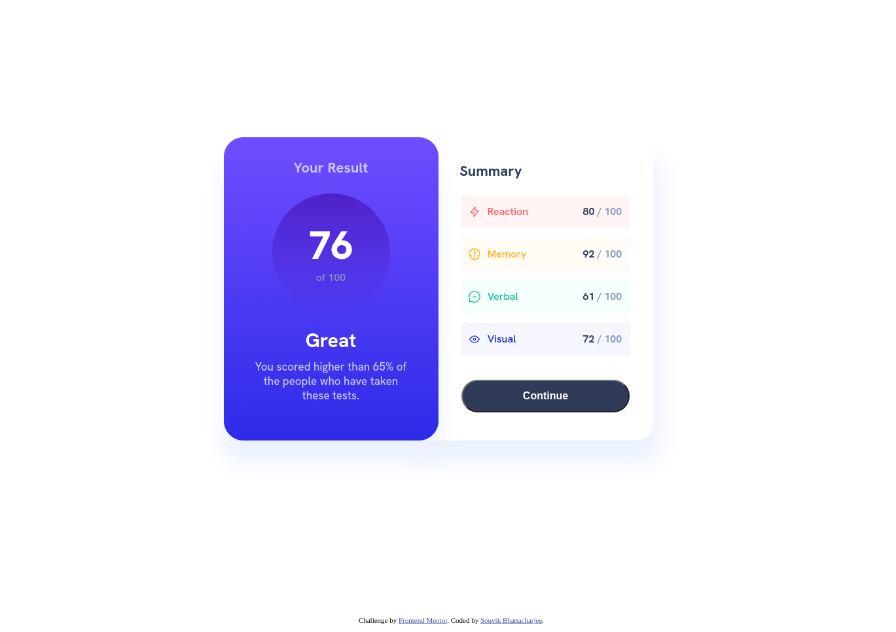

# Frontend Mentor - Results summary component solution

This is a solution to the [Results summary component challenge on Frontend Mentor](https://www.frontendmentor.io/challenges/results-summary-component-CE_K6s0maV). Frontend Mentor challenges help you improve your coding skills by building realistic projects.

## Table of contents

- [Overview](#overview)
  - [The challenge](#the-challenge)
  - [Screenshot](#screenshot)
  - [Links](#links)
- [My process](#my-process)
  - [Built with](#built-with)
  - [What I learned](#what-i-learned)
  - [Continued development](#continued-development)
  - [Useful resources](#useful-resources)
- [Author](#author)

## Overview

### The challenge

Users should be able to:

- View the optimal layout for the interface depending on their device's screen size
- See hover and focus states for all interactive elements on the page
- **Bonus**: Use the local JSON data to dynamically populate the content

### Screenshot



### Links

- GitHub: [Solution URL](https://github.com/coder-500/results-summary-component-fem-vanilla)
- Live Site URL: [Results summary component](https://result-summary-fem002.netlify.app/)

## My process

### Built with

- Semantic HTML5 markup
- CSS custom properties
- Flexbox

### What I learned

While completing this challenge, I got the opportunity to revisit some basic concepts of HTML and CSS.

Some of the new things that I learned in this challenge are,

- Adding a corner-only border
- Overlapping elements
- CSS shadow effect
- CSS Masking
- CSS Gradients
- CSS calc() function

Last but not least, I learned that "CSS is like a bear cub: cute and inoffensive, but when it grows, it'll eat you alive."

```html
<!-- I like this piece of HTML code -->

<li class="result reaction">
  Reaction
  <span>80 <span class="outof">/ 100</span></span>
</li>
```

```css
.proud-of-this-css {
  --s: 10px; /* the size on the corner */
  --t: 0.5px; /* the thickness of the border */
  --g: 0px; /* the gap between the border and image */

  padding: calc(var(--g) + var(--t));
  outline: var(--t) solid hsl(224, 30%, 75%); /* the color here */
  outline-offset: calc(-1 * var(--t));

  -webkit-mask: conic-gradient(at var(--s) var(--s), #0000 75%, #000 0) 0 0 / calc(
        100% - var(--s)
      )
      calc(100% - var(--s)), linear-gradient(#000 0 0) content-box;

  mask: conic-gradient(at var(--s) var(--s), #0000 75%, #000 0) 0 0 / calc(
        100% - var(--s)
      )
      calc(100% - var(--s)), linear-gradient(#000 0 0) content-box;
}
```

### Continued development

I will complete this challenge again in the future using Tailwind CSS.

### Useful resources

- [Corner Border](https://css-tip.com/corner-only-border-image/) - This helped me to figure out how to add corner only borders. I really liked this pattern and will use it going forward.
- [Overlapping 2 div](https://stackoverflow.com/questions/16372000/how-to-overlap-two-div-in-css) - This is an amazing article which helped me finally understand how to overlap 2 div. I'd recommend it to anyone still learning this concept.

- [Media Query](https://css-tricks.com/a-complete-guide-to-css-media-queries/) - This is an amazing article which helped me remember some concepts of media-query. I'd recommend it to anyone still learning this concept.

## Author

- Frontend Mentor - [@coder-500](https://www.frontendmentor.io/profile/coder-500)
- Twitter - [@iamsouvik_b](https://www.twitter.com/@iamsouvik_b)
